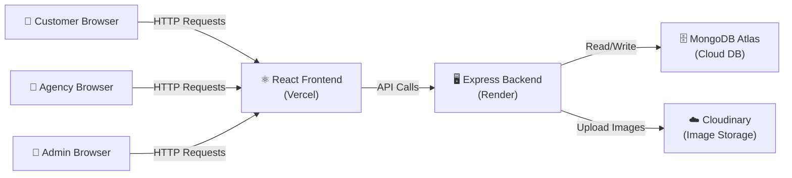
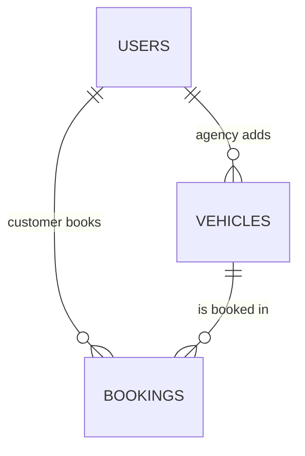
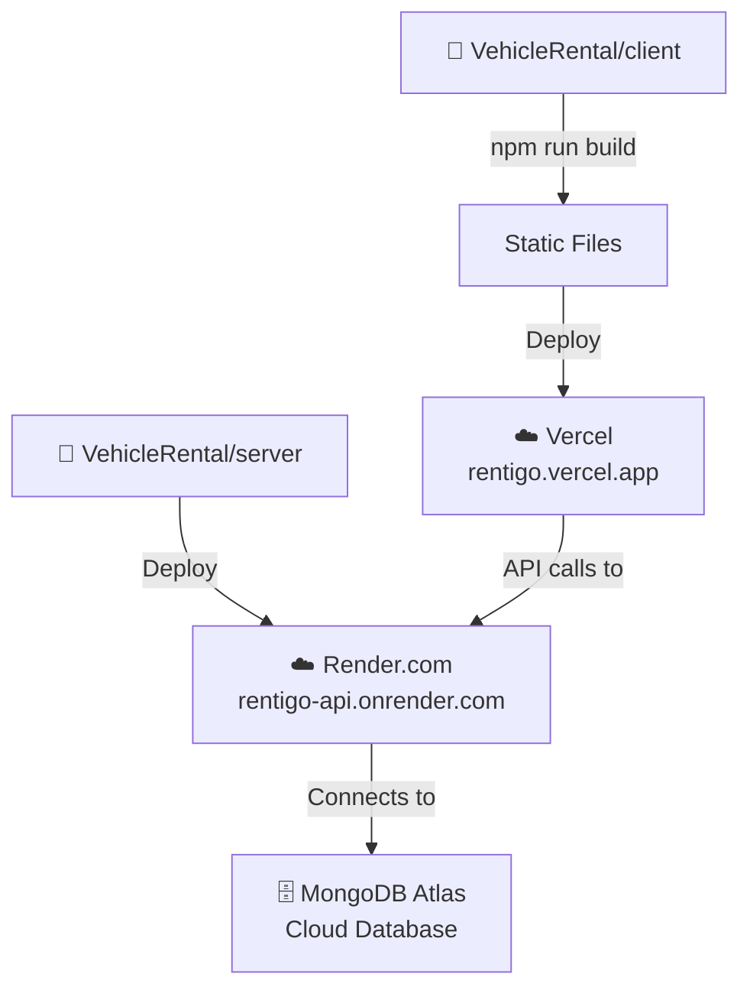

# RentiGo — Vehicle Rental Management System (Full Implementation Plan)

## What We Are Building

A web-based vehicle rental platform with **three types of users**:

| Role | What They Do |
|---|---|
| **Customer** | Browse vehicles, filter/search, book rentals, view booking history |
| **Agency (Owner)** | Add/edit vehicles, set pricing, approve/reject bookings, block vehicles for maintenance |
| **Admin** | Manage all users & agencies, approve vehicle listings, monitor bookings, view analytics |

---

## Your Setup (Confirmed)

- ✅ Node.js installed
- ✅ Git installed
- ✅ Vite + Tailwind CSS familiar
- ✅ MongoDB Atlas (free cloud database)
- ✅ Must be deployable at the end

---

## Technology Stack

| Layer | Technology | Why We Use It |
|---|---|---|
| **Frontend** | React.js (via Vite) + Tailwind CSS | Fast dev setup, popular, easy styling |
| **Routing (Frontend)** | React Router v6 | Navigate between pages without reload |
| **HTTP Client** | Axios | Send requests from frontend to backend |
| **Backend** | Node.js + Express.js | JavaScript on the server, lightweight |
| **Database** | MongoDB Atlas (cloud) | Free, no install, JSON-like data |
| **ODM (DB Helper)** | Mongoose | Easier way to talk to MongoDB from Node |
| **Authentication** | JSON Web Tokens (JWT) + bcrypt | Secure login, password hashing |
| **File Upload** | Multer + Cloudinary | Upload vehicle images (cloud-hosted) |
| **Deployment (Frontend)** | Vercel or Netlify | Free, one-click deploy for React apps |
| **Deployment (Backend)** | Render.com | Free tier, easy Node.js deployment |

> [!NOTE]
> **Why separate deployments?** Frontend and Backend will be deployed separately. This is the industry-standard approach and makes both easier to manage and scale. Our React app will call our backend via API URLs.

---

## Architecture Diagram



---

## Database Design (MongoDB Collections)

### 1. `users` — All people in the system

| Field | Type | Description |
|---|---|---|
| `_id` | ObjectId | Auto-generated unique ID |
| `name` | String | Full name |
| `email` | String (unique) | Login email |
| `password` | String | Hashed password (never stored as plain text) |
| `phone` | String | Contact number |
| `role` | String | `'customer'`, `'agency'`, or `'admin'` |
| `agencyName` | String | Only for agency role — their business name |
| `isApproved` | Boolean | Admin must approve agencies before they can list vehicles |
| `createdAt` | Date | Account creation timestamp |

### 2. `vehicles` — All rental vehicles

| Field | Type | Description |
|---|---|---|
| `_id` | ObjectId | Auto-generated unique ID |
| `agencyId` | ObjectId (ref → users) | Which agency owns this vehicle |
| `name` | String | e.g., "Honda Activa 6G" |
| `brand` | String | e.g., "Honda" |
| `modelYear` | Number | e.g., 2024 |
| `type` | String | `'2W'` or `'4W'` |
| `fuelType` | String | `'Petrol'`, `'Diesel'`, `'Electric'` |
| `transmission` | String | `'Manual'`, `'Automatic'` |
| `vehicleNumber` | String | Registration plate number |
| `pricePerDay` | Number | Daily rental price in ₹ |
| `pricePerWeek` | Number | Weekly rental price in ₹ |
| `pricePerMonth` | Number | Monthly rental price in ₹ |
| `imageUrl` | String | Cloudinary URL of vehicle photo |
| `status` | String | `'Available'`, `'Rented'`, `'Maintenance'` |
| `isAdminApproved` | Boolean | Admin must approve before vehicle is visible to customers |
| `location` | String | City where vehicle is available |
| `createdAt` | Date | When the vehicle was listed |

### 3. `bookings` — All rental reservations

| Field | Type | Description |
|---|---|---|
| `_id` | ObjectId | Auto-generated unique ID |
| `customerId` | ObjectId (ref → users) | Who booked |
| `vehicleId` | ObjectId (ref → vehicles) | What was booked |
| `agencyId` | ObjectId (ref → users) | Which agency owns the vehicle |
| `startDate` | Date | Rental start |
| `endDate` | Date | Rental end |
| `rentalType` | String | `'daily'`, `'weekly'`, `'monthly'` |
| `totalPrice` | Number | Calculated total cost |
| `status` | String | `'Pending'`, `'Approved'`, `'Rejected'`, `'Completed'`, `'Cancelled'` |
| `createdAt` | Date | When booking was made |

### Relationships Diagram



---

## Folder Structure (What Our Project Will Look Like)

```
VehicleRental/
├── client/                    ← React Frontend
│   ├── public/
│   ├── src/
│   │   ├── components/        ← Reusable UI pieces (Navbar, VehicleCard, etc.)
│   │   ├── pages/             ← Full pages (Home, Login, Dashboard, etc.)
│   │   ├── context/           ← Auth state management
│   │   ├── utils/             ← Helper functions (API calls via Axios)
│   │   ├── App.jsx            ← Main app with routes
│   │   ├── main.jsx           ← Entry point
│   │   └── index.css          ← Tailwind imports
│   ├── package.json
│   ├── vite.config.js
│   └── tailwind.config.js
│
├── server/                    ← Node/Express Backend
│   ├── config/                ← DB connection, environment variables
│   ├── models/                ← Mongoose schemas (User, Vehicle, Booking)
│   ├── routes/                ← API route files
│   ├── controllers/           ← Logic for each route
│   ├── middleware/             ← Auth checks, role checks
│   ├── utils/                 ← Helper functions
│   ├── server.js              ← Main entry point
│   └── package.json
│
├── .gitignore
└── README.md
```

---

## Step-by-Step Execution Plan

> [!IMPORTANT]
> Every step below is tiny and self-contained. After each step, I will:
> 1. Explain **what** we did and **why**
> 2. Give you a **git commit message**
> 3. **Wait** for your permission before moving to the next step

---

### 🔷 Phase 1: Project Setup (Steps 1–4)

| Step | What We Do | Why |
|---|---|---|
| **1.1** | Create the root `VehicleRental/` folder structure with `client/` and `server/` subfolders | Separating frontend and backend keeps the project organized |
| **1.2** | Initialize Git and create `.gitignore` | Track our code changes; ignore `node_modules` and secrets |
| **1.3** | Initialize the `server/` with `npm init` and install Express, Mongoose, dotenv, cors | These are the bare minimum packages our backend needs to run |
| **1.4** | Create `server.js` — a simple Express server that says "RentiGo API is running" | Verify our backend works before adding complexity |
| **1.5** | Create a `.env` file for secrets (MongoDB URL, JWT secret, port) | Never hardcode passwords; `.env` keeps secrets out of Git |
| **1.6** | Connect the server to MongoDB Atlas using Mongoose | Our app needs a database — this step confirms the connection works |
| **1.7** | Initialize the `client/` with Vite + React + Tailwind CSS | Set up our frontend with the tools you already know |
| **1.8** | Verify both `client` and `server` run independently | Make sure nothing is broken before we build features |

---

### 🔷 Phase 2: Authentication — Backend (Steps 2.1–2.5)

| Step | What We Do | Why |
|---|---|---|
| **2.1** | Create the `User` Mongoose model (`models/User.js`) | Define the shape of user data in our database |
| **2.2** | Install `bcryptjs` and `jsonwebtoken` | bcrypt hashes passwords; JWT creates login tokens |
| **2.3** | Create the **Register** API route (`POST /api/auth/register`) | Allows new users (customers & agencies) to sign up |
| **2.4** | Create the **Login** API route (`POST /api/auth/login`) | Returns a JWT token so the user stays logged in |
| **2.5** | Create **auth middleware** (`middleware/auth.js`) | Checks the JWT token on protected routes — blocks unauthorized access |
| **2.6** | Create **role middleware** (`middleware/role.js`) | Ensures only the right role (admin/agency/customer) can access certain routes |

---

### 🔷 Phase 3: Authentication — Frontend (Steps 3.1–3.5)

| Step | What We Do | Why |
|---|---|---|
| **3.1** | Set up React Router with basic page placeholders | Navigate between Login, Register, Home, Dashboard pages |
| **3.2** | Create the **Navbar** component | Every page needs a navigation bar at the top |
| **3.3** | Build the **Register page** (form UI) | Users need a form to create an account |
| **3.4** | Build the **Login page** (form UI) | Users need a form to log in |
| **3.5** | Connect Register & Login forms to the backend using Axios | Actually send the data to our server and handle the response |
| **3.6** | Create **AuthContext** — store the logged-in user's info | So every page knows who is logged in and what role they have |
| **3.7** | Create **ProtectedRoute** component | Redirect users to login if they try to access pages they shouldn't |

---

### 🔷 Phase 4: Vehicle Management — Backend (Steps 4.1–4.4)

| Step | What We Do | Why |
|---|---|---|
| **4.1** | Create the `Vehicle` Mongoose model (`models/Vehicle.js`) | Define the shape of vehicle data in the database |
| **4.2** | Create **Add Vehicle** API (`POST /api/vehicles`) — agency only | Agencies need to upload their vehicles to the platform |
| **4.3** | Create **Get All Vehicles** API (`GET /api/vehicles`) with filters | Customers need to browse and search vehicles |
| **4.4** | Create **Get Single Vehicle** API (`GET /api/vehicles/:id`) | View full details of one vehicle |
| **4.5** | Create **Update Vehicle** API (`PUT /api/vehicles/:id`) — agency only | Agencies need to edit price, status, details |
| **4.6** | Create **Delete Vehicle** API (`DELETE /api/vehicles/:id`) — agency only | Remove a vehicle from the listing |
| **4.7** | Set up **Cloudinary + Multer** for vehicle image uploads | Vehicles need photos; Cloudinary stores them in the cloud for free |

---

### 🔷 Phase 5: Vehicle Browsing — Frontend (Steps 5.1–5.4)

| Step | What We Do | Why |
|---|---|---|
| **5.1** | Build the **Home Page** — display vehicle cards in a grid | The main page customers see with all available vehicles |
| **5.2** | Build the **VehicleCard** component | A reusable card showing vehicle photo, name, price, type |
| **5.3** | Add **search and filter** UI (type, fuel, price, duration) | Let customers find exactly what they need |
| **5.4** | Build the **Vehicle Details** page | Full info page for a single vehicle with a "Book Now" button |

---

### 🔷 Phase 6: Booking System (Steps 6.1–6.5)

| Step | What We Do | Why |
|---|---|---|
| **6.1** | Create the `Booking` Mongoose model (`models/Booking.js`) | Define the shape of booking data |
| **6.2** | Create **Create Booking** API (`POST /api/bookings`) — customer only | Customer submits a booking request |
| **6.3** | Create **Get My Bookings** API (`GET /api/bookings/my`) — customer | Customer views their booking history |
| **6.4** | Build the **Booking Form** on the frontend (date picker, duration selector) | UI for customers to select dates and rental type |
| **6.5** | Build the **My Bookings** page on the frontend | Customers see their past and current bookings with status |

---

### 🔷 Phase 7: Agency Dashboard (Steps 7.1–7.4)

| Step | What We Do | Why |
|---|---|---|
| **7.1** | Create **Get Agency Bookings** API (`GET /api/bookings/agency`) | Agency sees all bookings for their vehicles |
| **7.2** | Create **Approve/Reject Booking** API (`PUT /api/bookings/:id/status`) | Agency controls which bookings to accept |
| **7.3** | Build the **Agency Dashboard** page — My Vehicles list | Agency sees all their listed vehicles |
| **7.4** | Build the **Add/Edit Vehicle** form page | Agency can add new vehicles or update existing ones |
| **7.5** | Build the **Agency Bookings** page — list with approve/reject buttons | Agency manages incoming booking requests |

---

### 🔷 Phase 8: Admin Dashboard (Steps 8.1–8.5)

| Step | What We Do | Why |
|---|---|---|
| **8.1** | Create **Admin: Get All Users** API (`GET /api/admin/users`) | Admin sees all registered users and agencies |
| **8.2** | Create **Admin: Approve Agency** API (`PUT /api/admin/users/:id/approve`) | Admin must approve agencies before they can list vehicles |
| **8.3** | Create **Admin: Approve Vehicle** API (`PUT /api/admin/vehicles/:id/approve`) | Admin reviews and approves vehicle listings |
| **8.4** | Create **Admin: Get All Bookings** API (`GET /api/admin/bookings`) | Admin monitors all bookings in the system |
| **8.5** | Create **Admin: Analytics** API (`GET /api/admin/analytics`) | Return KPIs: total users, total bookings, revenue, utilization |
| **8.6** | Build the **Admin Dashboard** page with stats cards | Admin homepage showing key numbers |
| **8.7** | Build **Admin: Manage Users** page | Table of all users with approve/block actions |
| **8.8** | Build **Admin: Manage Vehicles** page | Table of all vehicles with approve/reject actions |
| **8.9** | Build **Admin: All Bookings** page | Overview of every booking in the system |

---

### 🔷 Phase 9: Polish & UI Enhancements (Steps 9.1–9.4)

| Step | What We Do | Why |
|---|---|---|
| **9.1** | Add loading spinners and toast notifications | Better UX — users know when things are loading or succeeded/failed |
| **9.2** | Make all pages fully responsive (mobile-friendly) | Requirement says "mobile-first UI" |
| **9.3** | Add a **Footer** component | Professional look |
| **9.4** | Add a proper **Landing/Hero section** to the Home page | First impression matters — a beautiful banner |

---

### 🔷 Phase 10: Deployment (Steps 10.1–10.4)

| Step | What We Do | Why |
|---|---|---|
| **10.1** | Prepare `server/` for deployment (environment variables, start script) | Render needs specific config to run our backend |
| **10.2** | Deploy the **backend** to Render.com | Make our API accessible on the internet |
| **10.3** | Update the frontend API URL to point to the deployed backend | Frontend needs to know where to send requests |
| **10.4** | Deploy the **frontend** to Vercel | Make our website accessible on the internet |
| **10.5** | Final end-to-end testing on the live site | Verify everything works in production |

---

## API Routes Summary

| Method | Route | Who Can Access | Description |
|---|---|---|---|
| POST | `/api/auth/register` | Public | Register new user |
| POST | `/api/auth/login` | Public | Login |
| GET | `/api/auth/me` | Logged-in user | Get current user profile |
| GET | `/api/vehicles` | Public | Browse all approved vehicles |
| GET | `/api/vehicles/:id` | Public | Get single vehicle details |
| POST | `/api/vehicles` | Agency | Add a new vehicle |
| PUT | `/api/vehicles/:id` | Agency (owner) | Update vehicle details |
| DELETE | `/api/vehicles/:id` | Agency (owner) | Remove a vehicle |
| POST | `/api/bookings` | Customer | Create a booking |
| GET | `/api/bookings/my` | Customer | My booking history |
| GET | `/api/bookings/agency` | Agency | Bookings for my vehicles |
| PUT | `/api/bookings/:id/status` | Agency | Approve/Reject a booking |
| GET | `/api/admin/users` | Admin | List all users |
| PUT | `/api/admin/users/:id/approve` | Admin | Approve an agency |
| GET | `/api/admin/vehicles` | Admin | List all vehicles (inc. unapproved) |
| PUT | `/api/admin/vehicles/:id/approve` | Admin | Approve a vehicle listing |
| GET | `/api/admin/bookings` | Admin | All bookings |
| GET | `/api/admin/analytics` | Admin | Dashboard stats & KPIs |

---

## Deployment Strategy



---

## What's NOT Included (Out of Scope, Per Requirements)

- ❌ Online payment processing
- ❌ GPS vehicle tracking
- ❌ Insurance/damage management
- ❌ Native mobile app
- ❌ Dynamic pricing algorithms

---

## User Review Required

> [!IMPORTANT]
> Please review this full plan carefully. Here are the key decisions baked in:
> 
> 1. **Three roles**: Customer, Agency, Admin — each with their own dashboard
> 2. **Agency approval flow**: Admin must approve an agency before they can list vehicles
> 3. **Vehicle approval flow**: Admin must approve a vehicle before customers can see it
> 4. **Image uploads**: Using Cloudinary (free tier) for vehicle photos
> 5. **Deployment**: Frontend on Vercel, Backend on Render.com, DB on MongoDB Atlas
> 6. **~40 tiny steps** broken into 10 phases
>
> **If this looks good, tell me to start with Step 1.1 and we will begin!**
> If you want changes to anything — roles, database fields, the order of steps, deployment choices — let me know now.

## Open Questions

1. **Cloudinary**: Are you okay with using Cloudinary for vehicle image uploads? It has a generous free tier. If you'd prefer a simpler approach (just image URLs pasted manually), we can skip Cloudinary.
2. **Admin seeding**: Should we create one default admin account in the database manually, or build a special admin registration route?
3. **Tailwind version**: Which version of Tailwind CSS are you using (v3 or v4)? This affects the config setup slightly.
