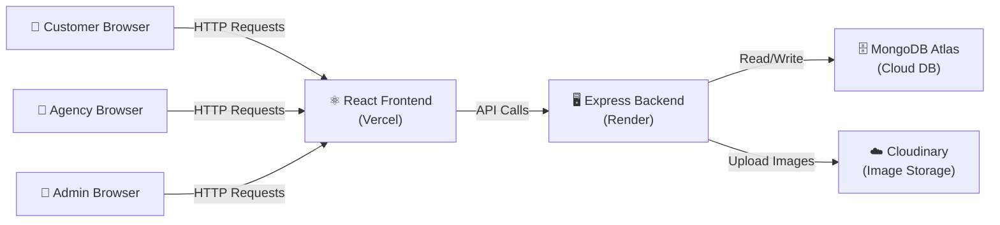
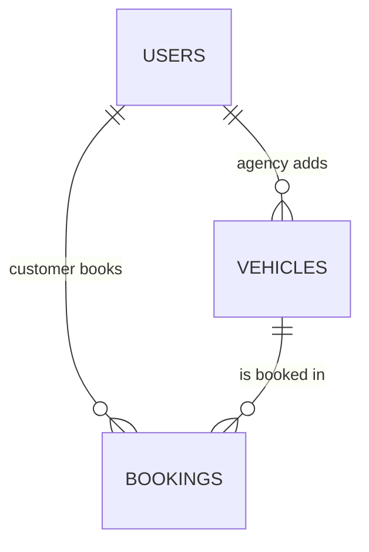

# 🚗 GoVroom - Premium Vehicle Rental Platform

**🌐 Live Application:** [https://go-vroom-umber.vercel.app/](https://go-vroom-umber.vercel.app/)

GoVroom is a comprehensive, full-stack vehicle rental platform built on the MERN stack. It connects Customers looking for premium cars or scooters with verified Rental Agencies. The platform features strict role-based access control, real-time booking management, secure JWT authentication, and a stunning dark-mode UI.

---

## 🌟 Key Features

- **Role-Based Dashboards**: Distinct interfaces and capabilities for Customers, Agencies, and Admins.
- **Secure Authentication**: Stateless JWT (JSON Web Token) authentication with HTTP headers.
- **Image Uploads**: Direct cloud integration with Cloudinary for seamless vehicle image uploads.
- **Booking Workflow**: Customers can request vehicles, and Agencies can Approve, Reject, or Mark as Completed from their dashboard.
- **Premium UI**: Built with React, Vite, Tailwind CSS, and shadcn/ui components, featuring a sleek, responsive dark theme.
- **Admin Controls**: A dedicated Admin panel to approve/reject new Agencies, manage users, and oversee all platform bookings.

---

## 🏗️ Architecture & Tech Stack

| Layer | Technology | Why We Use It |
|---|---|---|
| **Frontend** | React.js (via Vite) + Tailwind CSS | Fast dev setup, popular, easy styling |
| **Routing (Frontend)** | React Router v6 | Navigate between pages without reload |
| **HTTP Client** | Axios | Send requests from frontend to backend |
| **Backend** | Node.js + Express.js | JavaScript on the server, lightweight |
| **Database** | MongoDB Atlas (cloud) | Free, no install, JSON-like data |
| **ODM (DB Helper)** | Mongoose | Easier way to talk to MongoDB from Node |
| **Authentication** | JSON Web Tokens (JWT) + bcrypt | Secure login, password hashing |
| **File Upload** | Multer + Cloudinary | Upload vehicle images (cloud-hosted) |

### Architecture Diagram



---

## 🗄️ Database Design (MongoDB Collections)

### 1. `users` — All people in the system

| Field | Type | Description |
|---|---|---|
| `_id` | ObjectId | Auto-generated unique ID |
| `name` | String | Full name |
| `email` | String (unique) | Login email |
| `password` | String | Hashed password (never stored as plain text) |
| `phone` | String | Contact number |
| `role` | String | `'customer'`, `'agency'`, or `'admin'` |
| `agencyName` | String | Only for agency role — their business name |
| `isApproved` | Boolean | Admin must approve agencies before they can list vehicles |
| `createdAt` | Date | Account creation timestamp |

### 2. `vehicles` — All rental vehicles

| Field | Type | Description |
|---|---|---|
| `_id` | ObjectId | Auto-generated unique ID |
| `agencyId` | ObjectId (ref → users) | Which agency owns this vehicle |
| `name` | String | e.g., "Honda Activa 6G" |
| `brand` | String | e.g., "Honda" |
| `modelYear` | Number | e.g., 2024 |
| `type` | String | `'2W'` or `'4W'` |
| `fuelType` | String | `'Petrol'`, `'Diesel'`, `'Electric'` |
| `transmission` | String | `'Manual'`, `'Automatic'` |
| `vehicleNumber` | String | Registration plate number |
| `pricePerDay` | Number | Daily rental price in ₹ |
| `pricePerWeek` | Number | Weekly rental price in ₹ |
| `pricePerMonth` | Number | Monthly rental price in ₹ |
| `imageUrl` | String | Cloudinary URL of vehicle photo |
| `status` | String | `'Available'`, `'Rented'`, `'Maintenance'` |
| `isAdminApproved` | Boolean | Admin must approve before vehicle is visible to customers |
| `location` | String | City where vehicle is available |
| `createdAt` | Date | When the vehicle was listed |

### 3. `bookings` — All rental reservations

| Field | Type | Description |
|---|---|---|
| `_id` | ObjectId | Auto-generated unique ID |
| `customerId` | ObjectId (ref → users) | Who booked |
| `vehicleId` | ObjectId (ref → vehicles) | What was booked |
| `agencyId` | ObjectId (ref → users) | Which agency owns the vehicle |
| `startDate` | Date | Rental start |
| `endDate` | Date | Rental end |
| `totalPrice` | Number | Calculated total cost |
| `status` | String | `'pending'`, `'approved'`, `'rejected'`, `'completed'`, `'cancelled'` |
| `createdAt` | Date | When booking was made |

### Relationships Diagram



---

## 🚀 Setup & Installation Guide

Follow these steps to run the platform locally on your machine.

### 1. Clone the repository
```bash
git clone <your-repository-url>
cd VehicleRental
```

### 2. Install Dependencies
Install dependencies for both the frontend and backend concurrently from the root directory:
```bash
npm install
```

### 3. Environment Variables
You need to set up your `.env` file in the `server` directory. Create a file named `.env` in the `server/` folder and add the following keys:
```env
PORT=5000
MONGODB_URI=your_mongodb_connection_string
JWT_SECRET=your_super_secret_jwt_key
CLOUDINARY_CLOUD_NAME=your_cloudinary_name
CLOUDINARY_API_KEY=your_cloudinary_api_key
CLOUDINARY_API_SECRET=your_cloudinary_api_secret
```

### 4. Seed the Admin User
Before running the app, you need to create the root Admin account. Run the following script:
```bash
node server/scripts/seedAdmin.js
```
*(This creates the admin@govroom.com account automatically)*

### 5. Run the Application
You can start both the Vite Frontend (Port 5173) and the Express Backend (Port 5000) simultaneously using the root script:
```bash
npm run dev:all
```
Your application will now be running at: `http://localhost:5173`

---

## 🔑 Test Credentials

To quickly test the platform without registering new accounts, you can use the following pre-configured credentials:

### 1. Admin Account
Use this account to approve pending agencies, delete users, and view platform-wide bookings.
- **Email:** `admin@govroom.com`
- **Password:** `123456`

### 2. Agency Account
Use this account to list new vehicles, view your fleet, and approve/reject booking requests from customers.
- **Email:** `m@example.com`
- **Password:** `123456`

### 3. Customer Account
Use this account to browse vehicles, select dates, and request rentals from agencies.
- **Email:** `c@example.com`
- **Password:** `123456`

---
*Developed By : Anas Ghayas*
